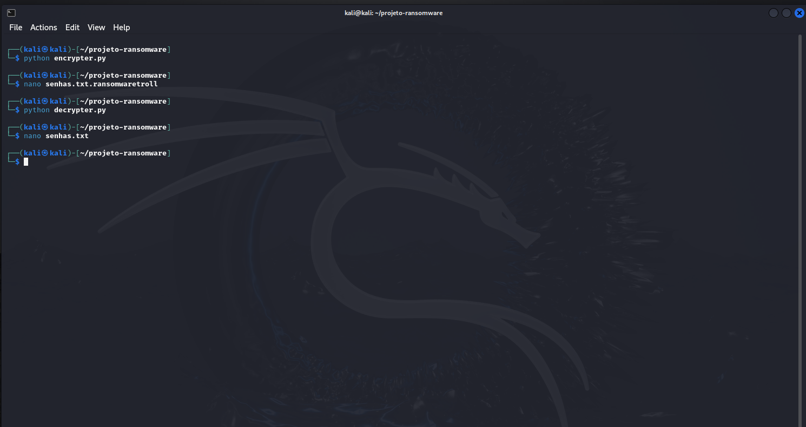
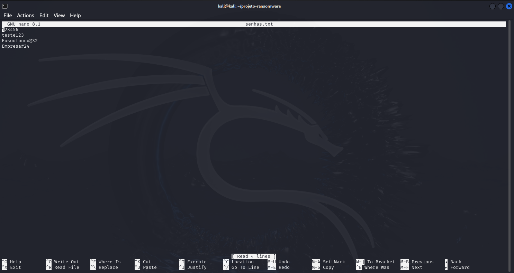

# Ransomware para criptogfafia e descriptografia de arquivos

### !IMPORTANTE: Este conteúdo não é para promover ou fomentar esse tipo de prática, e sim apenas para estudo de um dos ataques mais uasdos contra empresas atualmente "31/12/2024" (o funcional de um ransomware na prática).
### A prática das mesmas são considerados crime: Lei 12.737/2012 (Lei Carolina Dieckmann) e Lei 14.155/2021, que alterou o Código Penal para incluir modalidades específicas de crimes cibernéticos.

### Ferramentas

- Kali Linux
- Python

### Criando os arquivos de criptografia e descriptografia (não existe descriptografia é apenas um nome dado para a decodificação de algo criptografoado, isso quando se tem as chaves que foram usadas na criptografia)

- abra o terminal
- defina o caminho onde deseja criar uma pasta
- use `mkdir` para criar uma pasta
- use (nome_da_pasta) para acessá-la ou (..) para voltar uma pasta anterior

- instale o módulo de criptografia que vamos utilizar `pip install pyaes`
- crie um arquivo de teste: `touch senhas.txt` (use o nome que preferir, mas atenção ele será usado nos arquivos de criptografia e descriptografia)
- crie um arquivo para criptografar `touch encrypter.py`
- crie um arquivo para descriptografia `touch decrypter.py`

- para adicionar algo no arquivo de senhas.txt, use: `nano senhas.txt`
- após o terminal do nano, escreva o que deseja, após use: `CTRL + O` + `Enter` + `CTRL + X` (esses comandos fazem respetivamente: escreve o texto no arquivo, confirma a escrita do arquivo e sai do editor nano)

- para encryptar o nosso arquivo de "senhas.txt" use: `python encrypter.py`
- para vizualizar o arquivo criptografo use: `nano senhas.txt.ransomwaretroll` (lembrando que esta extensão final do arquivo, você pode personalizar da forma que preferir)
- use para sair do nano: `CTRL + x`
- para descriptografar o arquivo use: `python decrypter.py`
- para vizualizar o arquivo descriptografado use: `nano senhas.txt`

### Comandos no terminal do kali

### Resultados

### Arquivo "senhas.txt" ORIGINAL

### Arquivo "senhas.txt" criptografado, sendo agora "senhas.txt.ransonwaretroll"

### Arquivo "senhas.txt.ransonwaretroll" descriptografado, voltando agora para "senhas.txt"

